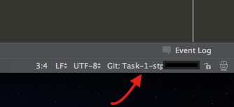
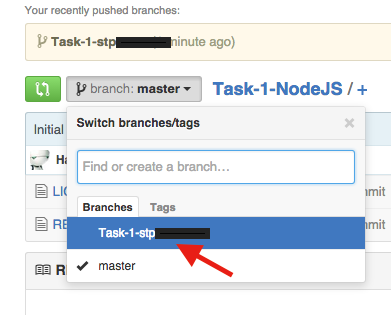

# Task-1-NodeJS
Das Repository für die erste Übungsaufgabe für alle Neueinsteiger in das Projekt. Installationshinweise sowie eine Anleitung zur Abgabe findet ihr unterhalb der Aufgabenstellung, scrollt einfach ein Stück nach unten.

## Abgabetermine

**Bachelor- und Master-PSE bis 15.10.2015 - 18:00 Uhr**

**CNAM bis 16.10.2015 - 21:00 Uhr**

## Ordnerstruktur und Dateiübersicht des Repositories
**Dummy Dateien zur Bearbeitung sind bereits angelegt worden, bitte diese benutzen!**
* **app** (Fontend)
* **api** (Backend, NodeJS Code)
* **documentation** (eure Dokumentation -> siehe Aufgabenstellung)
* **.gitignore** (Konfigurationsdatei mit Informationen, welche Dateien und Ordner *nicht* versioniert werden sollen)
* **README** (Diese Datei ;) )
* **LICENSE** (Lizenz des Repos)

##Aufgabenstellung
### Erste Schritte mit nodeJS
Im Kurs werden die modernen Webtechnologien nodeJS und AngularJS verwendet.
Als bereits vorrausgesetzt werden Grundlagen zur Programmierung im Allgemeinen, Javascript Grundlagen zur Variablendeklaration, Prädikativen und objektorientierten Programmierung, Grundlagen in HTML5 & CSS3, sowie prinzipielles Verständnis darüber wie Webbasierte Anwendungen funktionieren.

### Hinweise zur Bearbeitung

* Die Aufgabe ist innerhalb des Task-1-NodeJS Repositories auf einem eigenen Branch (siehe Installationshinweise) zu bearbeiten
* Es werden nur die bereits angelegten Dummy Dateien zur Lösung benötigt

**Dokumentiert kurz euren Lösungsweg sowie aufgetretene Probleme** (in der Datei ```documentation/task1.txt```)

Zur Einführung beginnen wir mit einer einfachen Aufgabe zum Thema nodeJS. Es soll eine kleine API mit Express entwickelt werden. 

**Installiert Express als Package in euer Repository** -> npm install express --save (in der Console/Terminal von Webstorm ausführen, wenn ihrs nicht gleich findet schaut hier -> https://www.jetbrains.com/webstorm/help/working-with-embedded-local-terminal.html)

**Lest euch folgende Übersicht zum Routing in nodeJS Expresss 4.X durch:**
* http://expressjs.com/starter/basic-routing.html

**app.get('/',** soll eine einfache Webseite anzeigen auf der sich ein Form mit Inputfield für einen Benutzernamen, ein Passwordfield für ein Passwort und ein Button befinden.
Diese Webseite soll die folgende Logik besitzen: Bei Klick auf den Button werden die Werte der Inputfields gelesen und als asynchrones HTTP Post Request an die URL /login im JSON Format (siehe unten) versendet. Die Server-Response der Abfrage soll über eine Alertbox in Form des HTTP Status an den Benutzer ausgegeben werden.

**app.post('/login',** soll die Validierung eines Logins durchführen, wobei die Schnittstelle die folgenden Daten Benutzernamen und Passwort, in folgendem JSON Format: { “username”: “foo@bar.de”, “password”: “foobar” } erfordert.

**Kleine Übersicht zu den verschiedenen HTTP Statuscodes:**
* https://en.wikipedia.org/wiki/List_of_HTTP_status_codes

**Die Daten müssen nach folgender Logik validiert/überprüft werden:**

* Falls der Benutzername admin und das Passwort admin lauten, soll die Schnittstelle eine Response mit Statuscode 200 (OK) zurückliefern.
* Falls die Zugangsdaten vorhanden aber nicht korrekt sind, soll die Schnittstelle eine Response mit Statuscode 401 (Not Authorized) zurückliefern. Außerdem soll der Versand dieser Reponse 2 Sekunden verzögert stattfinden.
* Falls die Daten nicht korrekt formatiert sind, oder diese nicht komplett/gar nicht vorhanden sind, soll die Schnittstelle eine Response mit Statuscode 400 (Bad Request) zurückliefern.

**Hinweis**

* für den Frontend Teil die im Repo bereits als Dummy angelegten Dateien ```app/index.html``` bzw. ```app/login.html``` benutzen
* für den Node Server die Dummy angelegte Datei ```api/server.js``` benutzen
* den Server könnt ihr in einer Konsole über den Befehl ```node server.js``` starten, danach ist er im browser unter localhost:(im Code gewählter Port) erreichbar 

## Nützliche Links zur Einarbeitung
Die untenstehenden Links müssen nicht alle angeschaut werden. Es stecken jedoch sehr viele nützliche Informationen darin, die euch für diese Aufgabe und im Laufe des PSE's weiterhelfen werden.

* https://www.jetbrains.com/webstorm/help/using-git-integration.html
* https://egghead.io/lessons/nodejs-first-api-with-node-js-express-and-mongodb
* https://codeforgeek.com/2014/06/express-nodejs-tutorial/
* http://www.tutorialspoint.com/nodejs/nodejs_express_framework.htm


# Installationshinweise

## Git Installation

* Für Windows: Ladet euch Git herunter und installiert es -> https://git-scm.com/downloads
* Unter Windows: Option Git zum Systempath hinzufügen auswählen!
* Für Linux: sudo apt-get update -> sudo apt-get install git

## NodeJS Installation

* Für Windows: Ladet euch NodeJS herunter und installiert es -> https://nodejs.org/en/
* Für Linux: sudo apt-get update -> sudo apt-get install --yes nodejs -> sudo apt-get install --yes build-essential (https://github.com/nodejs/node-v0.x-archive/wiki/Installing-Node.js-via-package-manager)

## Webstorm Installation

* Ladet euch Webstorm auf https://www.jetbrains.com/webstorm/download/ herunter und installiert die Anwendung
* Ihr könnt euch auf https://account.jetbrains.com/login mit eurer Hochschuldaddresse registrieren
* Danach könnt ihr auf https://www.jetbrains.com/shop/eform/students eine kostenlose Studentenlizenz beantragen
* Anschließend müsst ihr die Lizenz über den Confirmation Link der an eure Stud-Addresse geschickt wurde oder in der Jetbrains Accountverwaltung (account.jetbrains.com) akzeptieren

## Projekt Clonen
Bevor ihr anfangen könnt, müsst ihr erst einmal über git (Versionierungstool, ähnlich zu SVN) das Projekt auschecken:

* Startet Webstorm
* Beim ersten mal: Mit Webstorm Accnamen anmelden
* **TROUBLESHOOTING:** Wenn unter Ubuntu folgender Fehler auftreten sollte ("JetProfile connection error: SSLHandshakeException..") -> sudo update-ca-certificates -f (in einer console eingeben, danach sollte es dann gehen)
* Wenn ihr bereits vorher ein Projekt angelegt habt wählt ihr über *VCS->Checkout from version control"-> Github*
* Wenn ihr Webstorm das erste Mal startet wählt *Checkout from version control"-> Github* aus
* wählt das Github-Repository und macht einen checkout

``` 
https://github.com/PSE-Selbstentwicklungsraum/Task-1-NodeJS.git
```

###Troubleshooting: Cannot run Program git.exe CreateProcess Error=2

Den richtigen Path zur Git.exe einfügen unter Settings / VCS / Git siehe Foto:

**Funktioniert cmd/git.cmd wie im bild gezeigt nicht, nehmt bin/git.exe**


* **WICHTIG**: Ihr arbeitet nun auf dem Master-Branch. Ihr sollt aber auf eurer eigenen Code-Basis arbeiten. Hierfür legt ihr einen neuen Branch über *VCS->Git->Branches* an. Wählt hierfür bitte das Namens-Schema: ```Task-1-[Eure Veranstaltung(MPSE/BPSE/CNAM)]-[Euer st-Accountname]```
* Wenn ihr diesen Schritt erledigt habt, müsste unten rechts in der Ecke nun der Name eures Banches stehen:
* 


* Nun arbeitet ihr auf eurem eigenen Branch und könnt mit der Bearbeitung der Hausaufgabe anfangen. 

## Ergebnis Veröffentlichen / Abgeben

* **Achtung:** Nochmal zur Erinnerung, ihr solltet in einem eigenen Branch mit dem Namensschema ```Task-1-[Eure Veranstaltung(MPSE/BPSE/CNAM)]-[Euer st-Accountname]``` gearbeitet haben, damit wir die Aufgabe der richtigen Person zuordnen können!
*Sobald ihr mit einem Teil der Aufgabe fertig seid bzw komplett fertig seid könnt ihr eure Version der Hausaufgabe über *VCS->Commit Changes* in das Github Repository hochladen.
* **WICHTIG:** Ein Commit alleine reicht nicht um eure Code-Änderungen auf Github zu laden. Wählt deshalb auf dem commit-Knopf unten *Commit and Push* aus und bestätigt die Rückfrage von Webstorm mit *Commit* und danach mit *Push* (In den zwei erscheinenden Fenstern).
* Wenn ihr nun in das Repository auf Github.com schaut, solltet ihr über das Branch-Dropdown-Feld euren Branch und den von euch gepushten Code sehen:
* 
*